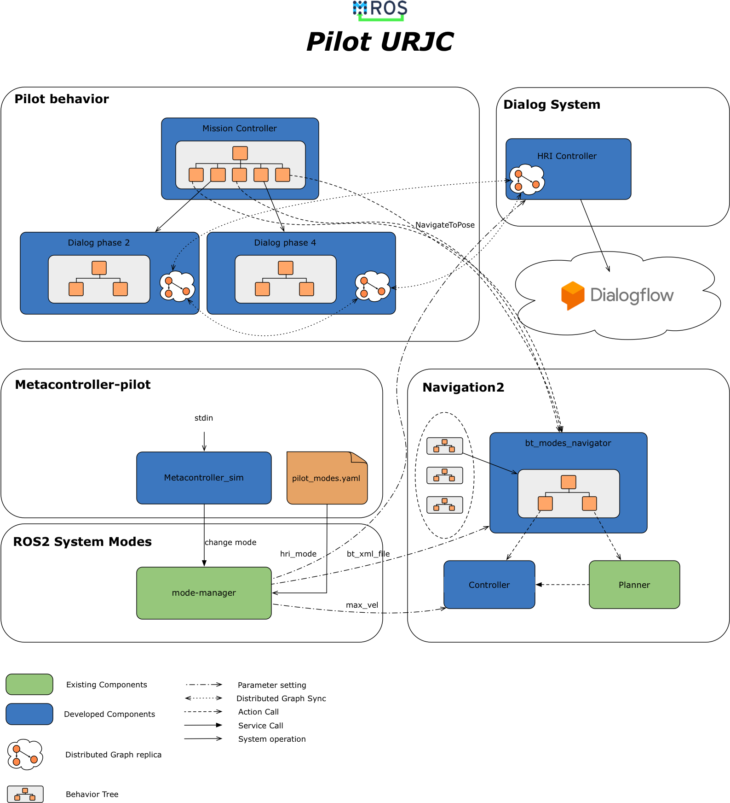

# Pilot-URJC

This repo contains the first pilot prepared by the URJC. It is composed of several elements that are explained below:

### Pilot Behavior

This module contains the components that control the robot's mission during the pilot. We have used BICA components to generate the robot's behavior. 

A [BICA](https://github.com/IntelligentRoboticsLabs/BICA/tree/ros2) component is a ROS2 lifecycle node that can activate another BICA component by merely declaring it as a dependency. Besides, each BICA component can use behavior trees to implement its behavior, being able to declare the dependencies on each behavior tree leaf. In this way, we can have hierarchical behavior trees. 

In this pilot, the mission controller uses a behavior tree to sequence the phases of the test. In some stages, the robot is made to navigate, and in others, it starts a dialogue. As the dialogs are also composed of several stages, other BICA components have been used to implement it, activated from a leaf of the mission tree's behavior tree.

### Dialog System

The dialogue system can use both the robot's audio and tablet to communicate with a human. The selection of the communication mode is carried out using the hri_mode parameter. If the hri_mode parameter is "audio" the audio is used. If the hri_mode parameter is "tablet", the robot tablet is used.

The dialogue system uses a [distributed graph](https://github.com/IntelligentRoboticsLabs/BICA/tree/ros2/bica_graph) that is used in BICA for many tasks. When a "say: XXX" arc is added between the robot and the person, the robot says XXX. If the arc is "ask: YYY", a dialogue takes place until YYY finds out.

### Metacontroller-pilot

This module contains a ROS node that simulates the contingencies in the specifications of this pilot. Besides, it is responsible for asking the mode-manager to change the system mode. This node presents a simple menu in which a contingency can be activated, and when it ends. The module also contains the configuration of the pilot system modes.

The modes are:

1. Normal.
2. Low_Battery: The robot is running out of battery. The robot must slow down the speed, and bt_modes_navigator informs the operator about this contingency.
3. Obstructed: The robot finds an obstacle, and it can't find an alternative path. The robot informs the operator about this contingency.
4. Lost: The localization information has degraded. The robot runs recovery behaviors.
5. Network_Down: Network is down, so the dialog must be carried out using the tablet instead of DialogFlow, which requires a network connection.

The modes change next parameters in the components (shown in the figure), with some effects:

* bt\_modes\_navigator [bt\_xml\_file]: bt_modes_navigator changes in runtime the behavior tree to adapt to the current situation. In mode obstructed, the behavior tree only contains an action leaf to contact the operator. In mode Low_Battery, the behavior tree also includes an action leaf to contact the operator. In mode Lost, the behavior Tree only contains activations of recovery behaviors.
* Controller [max\_vel]: Each mode defines an adequate speed.
* HRI Controller [hri_mode]: This parameter selects if the communication must be carried out using the tablet, or the audio.




## Launching pilot-urjc demo
This pilot has been tested on different platforms. Above we show how to run the demo in each one.
First of all, we have to download the dependencies packages. We will use **vcs-tool**
  ```
    cd [ros2_ws]/src
    git clone https://github.com/MROS-RobMoSys-ITP/Pilot-URJC.git
    vcs import < Pilot-URJC/dependencies.repos
    cd ..
    rosdep install --from-paths src --ignore-src -r -y
    colcon build --symlink-install
  ```  
### Real TIAGo robot.
  #### Before start:
  - Make sure that the navigation, localization and map-server are switched off in the robot before start the demo.
  - The shell windows that will launch the ros1_bridge and the ros1 components needs a correct [network configuration](http://wiki.ros.org/ROS/NetworkSetup), setting the ROS_IP and ROS_MASTER_URI environment variables.
  - We have used rmw_cyclonedds_cpp as RMW_IMPLEMENTATION for the tests.
  
1. ****:
  To launch the demo in real TIAGo we have to use the ros1_bridge package, at this moment TIAGo drivers are not migrated to ROS2.
  ```
    ros2 run ros1_bridge dynamic_bridge __log_disable_rosout:=true
  ```
2. **[nav2-TIAGo-support](https://github.com/IntelligentRoboticsLabs/nav2-TIAGo-support)**:
  The integration of the nav2 and TIAGo through the ros1_bridge needs two tools to fix some issues.
  ```
    rosrun tf_static_resender tf_static_resender
  ```
  ```
    rosrun cmd_vel_mux cmd_vel_mux_node
  ```
  
3. **A dummy metacontroller**:
  With this tool, you can simulate different contingency scenarios.
  ```
    ros2 run metacontroller_pilot metacontroller
  ```
4. **Demo launcher**:
  This launcher includes rviz, nav2, amcl, map-server, **[system-modes](https://github.com/micro-ROS/system_modes)**, etc.
  The **system-modes mode-manager** takes the modes description from params/pilot_modes.yaml.
  ```
    ros2 launch pilot_urjc_bringup nav2_tiago_launch.py
  ```
  
### Launching in simulated turtlebot3.

1. **Launch gazebo sim and nav2 system (gazebo headless mode ON):**
  ```   
    ros2 launch nav2_bringup nav2_tb3_system_modes_sim_launch.py
  ```
2. **A dummy metacontroller**:
  With this tool, you can simulate different contingency scenarios.
  ```
    ros2 run metacontroller_pilot metacontroller
  ```

3. **[system-modes](https://github.com/micro-ROS/system_modes)**:
  ```
    ros2 run system_modes mode-manager [ros2_ws]/src/Pilot-URJC/pilot_urjc_bringup/params/pilot_modes.yaml
  ```

### Launching in simulated turtlebot2.

1. **Turtlebot ROS1 Gazebo simulator:**
  Launch the turtlebot2 simulator and its sensors. If you don't have a launcher to do this, you can find an example [here](https://github.com/IntelligentRoboticsLabs/gb_robots/tree/simulator) 
  ```   
    ros2 launch gb_robots sim_house.launch
  ```
  
2. ****:
  ```   
    ros2 launch nav2_bringup nav2_tb3_system_modes_sim_launch.py
  ```
3. **[nav2-TIAGo-support](https://github.com/IntelligentRoboticsLabs/nav2-TIAGo-support)**:
  The integration of the nav2 and turtlebot2 through the ros1_bridge needs one tools to fix some issues.
  ```
    rosrun tf_static_resender tf_static_resender
  ```
4. **A dummy metacontroller**:
  With this tool, you can simulate different contingency scenarios.
  ```
    ros2 run metacontroller_pilot metacontroller
  ```
5. **Demo launcher**:
  This launcher includes rviz, nav2, amcl, map-server, **[system-modes](https://github.com/micro-ROS/system_modes)**, etc.
  The **system-modes mode-manager** takes the modes description from params/pilot_modes.yaml.
  ```
    ros2 launch pilot_urjc_bringup nav2_turtlebot2_launch.py
  ```
 
